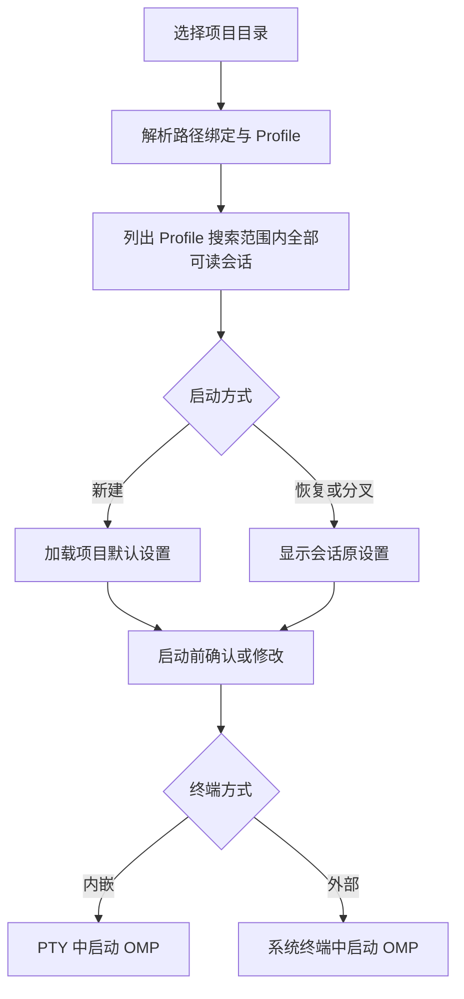
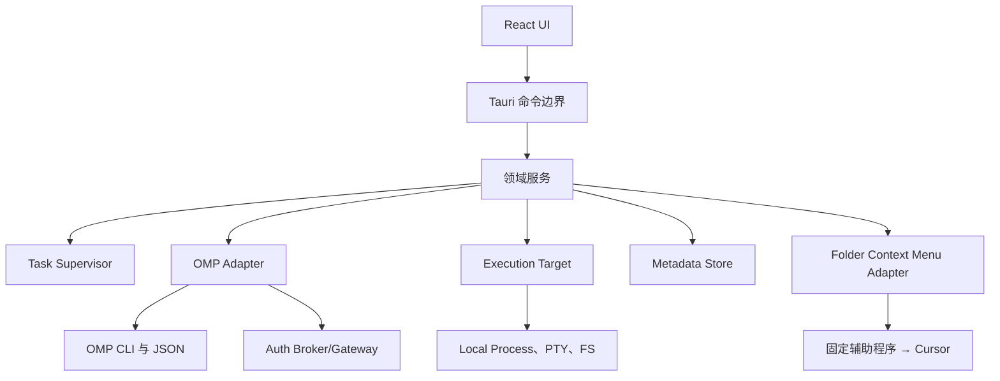

# OMP Manager 完整需求文档

> 文档类型：产品需求文档（PRD）+ 技术设计基线  
> 版本：1.1 草案  
> 日期：2026-08-28  
> 工作名称：OMP Manager（名称可在发布前替换）  
> 当前实施基线：M0 已完成；下一实施里程碑为 M1

## 1. 产品定义

OMP Manager 是一个面向 Windows 与 Linux 的本地桌面软件，用图形界面管理 [Oh My Pi（OMP）](https://github.com/can1357/oh-my-pi) 的项目目录、历史会话、Profile、账号凭证、模型角色和启动终端。

它不是新的 AI 编程 Agent，也不替代 OMP。它是 OMP 的本地控制台：用户选择项目目录后，可以先查看该目录下的全部历史会话，再决定新建、恢复或分叉会话，并在启动前确认或修改 Profile、账号策略、模型和终端方式。

### 1.1 一句话价值

把原本分散在命令行、配置文件、多个 Profile 和本地凭证来源中的 OMP 操作，收敛成一个安全、可搜索、可恢复的桌面管理界面。

### 1.2 目标用户

- 第一阶段：软件作者本人，本机单用户使用。
- 后续阶段：公开发布给同时维护多个项目、多个模型提供商或多个账号的 OMP 用户。
- 第一版执行目标仅为本机；架构预留 WSL 与 SSH 远程执行目标，但不在第一版交付远程功能。

### 1.3 已确认的产品决策

| 主题        | 决策                                                              |
| ----------- | ----------------------------------------------------------------- |
| 桌面平台    | Windows、Linux                                                    |
| 项目切换    | 以本地文件夹为入口，进入不同目录即切换项目上下文                  |
| 多历史会话  | 点击项目后先列出当前 Profile 搜索范围内的全部可读会话，由用户选择 |
| 恢复会话    | 显示原模型与账号设置；可原样继续，也可修改后启动                  |
| 新建会话    | 每个项目保存固定默认值，启动前仍可修改                            |
| 终端        | 同时支持内嵌终端与外部系统终端                                    |
| 凭证        | 完整管理，并能检测是否可用                                        |
| 外部来源    | 常见来源一键导入；支持手动重新同步                                |
| 同步方向    | 来源到 OMP 的单向、按需同步；不做持续监听与双向同步               |
| 模型角色    | 默认展示常用角色；高级设置展示 OMP 的全部角色                     |
| 账号绑定    | 默认让 OMP 自动选择；项目或角色可选固定 Profile/凭证              |
| OMP 安装    | 缺失或过旧时支持一键安装、升级和重新检测                          |
| Cursor 集成 | 应用内本机项目动作可用；系统文件夹右键入口默认关闭、按需安装      |
| 运行位置    | 第一版本机，预留 WSL/SSH 执行目标接口                             |
| 发布策略    | 先自用，但按未来公开发布的安全和可维护标准设计                    |

### 1.4 文档解释规则与实施基线

1. 本文描述产品目标和验收边界；`docs/omp-compatibility.md` 记录已经实际验证的 OMP 版本、接口和降级结论；`README.md` 与 `docs/architecture.md` 记录当前实现状态。三者发生差异时，不得用愿景覆盖已验证事实。
2. “必须”表示第一版不可省略的要求；“应该”表示除非有记录充分理由，否则必须实现；“可以”表示可选增强。带“按能力显示”的操作不构成底层能力已经存在的声明。
3. 截至 2026-08-28，仓库已完成 M0 骨架，并仅对 Linux x86_64 上的 OMP 18.0.3 做过运行时验证。上游 `main`、发布版本和用户本机版本可能不同，产品功能必须由带证据的能力探测启用，不能仅按版本号或本文命令示例启用。
4. 本文中的“完整管理”指在 OMP 当前公开、安全接口允许的范围内提供完整体验：可用能力直接完成，不可用能力承载 OMP 官方交互流程或明确禁用并解释；绝不以直接修改 `agent.db`、猜测内部结构或静默换账号来补齐界面。
5. 当前开发应在已有 M0 代码上增量进入 M1，不重新搭建技术骨架、不清空兼容性结论，也不把目标目录结构误当成搬迁要求。

## 2. 产品目标与非目标

### 2.1 第一版目标

1. 自动发现 OMP、显示路径和版本，并完成安装、升级、重新检测与诊断。
2. 以项目目录组织历史会话，支持搜索、预览、恢复、分叉、导出、归档和恢复删除。
3. 以 OMP Profile 作为主要隔离边界，管理项目路径与 Profile、模型角色、账号策略之间的绑定。
4. 图形化列出模型与常用/高级角色，替代日常使用中的 `/model` 选择流程。
5. 统一展示本机账号与凭证的来源、状态、到期时间和可用性；按后端真实能力支持安全测试、登录、导入、禁用、注销或删除。
6. 从 OMP 原生存储和常见第三方本地管理器导入凭证；导入前预览，之后可手动重新同步。
7. 在内嵌 PTY 或外部终端中，以明确的目录、Profile、会话和模型参数启动 OMP。
8. 不复制、不泄露原始密钥；所有日志、诊断导出和错误报告默认脱敏。用户主动生成的会话 HTML 导出属于敏感内容导出，必须明确提示且不进入诊断包。
9. 为本机项目提供安全、键盘可达的“用 Cursor 打开”，并可由用户选择安装适用于未登记目录的操作系统文件夹右键入口；两者均不开放任意编辑器或命令执行。

### 2.2 第一版非目标

- 不重写 OMP 的对话、工具调用或模型请求逻辑。
- 不提供云端账号、团队协作、跨设备同步或遥测后台。
- 不在第一版执行 WSL、Docker 或 SSH 远程会话。
- 不承诺识别任意未知第三方管理器；采用“内置常见适配器 + 可扩展适配器接口”。
- 不直接修改 OMP 的 `agent.db` 或依赖未声明的 SQLite 表结构。
- 不手工重写 OMP 会话 JSONL；会话内容以只读方式解析，恢复与分叉交给 OMP。
- 不默认运行可能产生模型费用的严格凭证测试。
- 不进行后台持续扫描或双向同步外部凭证来源。
- 第一版不提供用户自定义外部编辑器命令、任意参数模板或通用“用其他程序打开”；Cursor Agent CLI（`agent`）不作为桌面编辑器回退。

## 3. 设计原则

1. **OMP 是事实来源**：运行、会话恢复、模型解析和认证由 OMP 完成；管理器只编排公开接口。
2. **能力探测优于版本猜测**：启动时检测命令、参数和 JSON 能力；功能不可用时明确降级。
3. **Profile 优先隔离**：用 OMP Profile 分离认证、会话、设置和缓存，减少跨项目串用账号的风险。
4. **路径决定上下文**：项目以规范化绝对路径标识，并处理符号链接、Windows 大小写、UNC 路径和 Git worktree。
5. **结构化秘密不进入前端**：管理页面只得到凭证引用、掩码身份和状态；原始密钥不进入领域 DTO、普通前端状态、日志或本地管理数据库。内嵌 PTY 是明确隔离的透明用户终端，可能短暂显示/输入子进程自行输出/请求的敏感文本，按 FR-11 的非持久化边界处理，不能被误称为无秘密通道。
6. **所有危险操作可解释**：删除、覆盖、严格测试、安装脚本和配置改写都先显示目标与影响，再由用户确认。
7. **失败要可恢复**：配置原子写入并备份；会话先移入回收站；导入不改动来源。
8. **本地先行、执行目标抽象**：第一版实现 `LocalTarget`，所有 OMP 调用仍通过统一执行目标接口，为 WSL/SSH 留出位置。
9. **证据与状态可见**：界面区分“已验证可用”“文档声明但未验证”“不可用”和“探测失败”，并显示证据版本、时间与刷新入口。
10. **缓存不是事实来源**：项目、会话、模型和凭证索引都可过期；涉及启动、覆盖或删除时必须重新校验真实目标。
11. **无意外后台行为**：启动时不自动登录、刷新 OAuth、请求用量、刷新远程模型目录、安装/升级或执行可能修改 OMP 文件的探测。
12. **增量交付不伪装完成**：页面只展示已经连接真实领域服务的能力；未实现功能使用明确的里程碑说明，不使用假数据、空按钮或无效开关。

## 4. 核心概念

| 概念                         | 含义                                                               | 数据归属                   |
| ---------------------------- | ------------------------------------------------------------------ | -------------------------- |
| Execution Target             | OMP 实际运行的位置；第一版只有本机                                 | 管理器                     |
| OMP Installation             | 可执行文件路径、版本、能力和健康状态                               | 探测缓存                   |
| Profile                      | OMP 的认证、会话、设置和缓存隔离单元                               | OMP                        |
| Project                      | 用户选择的本地项目目录                                             | 管理器索引                 |
| Project Binding              | 路径到 Profile、模型默认值、账号策略的映射                         | 管理器                     |
| Session                      | OMP 在特定工作目录下的历史会话                                     | OMP                        |
| Credential Reference         | 指向 OMP/认证代理中凭证的非秘密标识                                | OMP；管理器仅缓存引用      |
| Model                        | `provider/modelId` 唯一选择器及其能力                              | OMP                        |
| Model Role                   | `default`、`smol`、`slow`、`plan` 等用途角色                       | OMP 配置/项目默认值        |
| Import Source                | 可重复读取的外部凭证来源                                           | 管理器元数据               |
| LaunchPlan                   | 新建、恢复、分叉或导出前计算出的不可变一次性启动计划               | 运行时；不持久化秘密       |
| Capability Evidence          | 某 OMP 二进制上某能力的探测方式、结果、时间与安全等级              | 管理器探测缓存             |
| Authorized Root              | 用户明确授权管理器读取或写入的项目、Agent、导入/导出目录           | 管理器；不含目录内容       |
| Background Operation         | 声明可取消性、可观察、有超时和稳定 ID 的扫描、导入、测试或安装任务 | 运行时；仅持久化非秘密摘要 |
| App Update                   | OMP Manager 自身的版本更新，与 OMP 二进制更新严格分离              | 管理器发布系统             |
| External Editor Registration | 经验证的 Cursor 桌面启动器及应用内/系统菜单注册状态                | 管理器；不授予项目读写权限 |

## 5. 信息架构

左侧主导航固定为：

1. 概览
2. 项目
3. 会话
4. 账号与凭证
5. 模型
6. 导入与同步
7. 终端
8. 设置与诊断
9. 回收站

### 5.1 概览

- OMP 可执行文件、版本、Profile 和整体健康状态。
- 可用/异常/即将到期的凭证数量。
- 最近项目、最近会话和正在运行的终端。
- “选择项目并启动”“继续上次会话”“检测更新”快捷入口。
- 需要处理的警告：OMP 缺失、版本不兼容、配置解析失败、凭证过期、导入源失效。

### 5.2 核心启动流程

### 5.3 启动参数优先级

从高到低：

1. 本次启动弹窗中的显式修改。
2. 恢复会话所记录的原模型与凭证设置。
3. 当前项目路径绑定的 Profile、角色模型和账号策略。
4. 当前 OMP Profile 的默认配置。
5. OMP 全局默认配置。

界面必须逐项标出设置来源，例如“本次覆盖”“来自会话”“来自项目”“来自 Profile”，避免用户误以为修改了永久配置。

## 6. 功能需求

### FR-01 OMP 检测、安装与升级

1. 按以下顺序寻找 OMP：用户手动指定路径、当前进程 `PATH`、平台常见安装位置。
2. 使用 `omp --version` 验证候选文件，保存路径、版本、架构和探测时间。
3. 探测结果必须关联可执行文件的规范路径、版本、文件身份（mtime + 大小；可行时加哈希）、探测时间、探测方法和证据等级；任一身份变化都使缓存失效。
4. 自动被动探测仅运行固定白名单、无网络、无登录、无用户数据写入的命令。Profile、`--cwd`、恢复、分叉、模型、配置、usage、Auth Broker/Gateway 等能力分别记录，不因根帮助文本出现一个词就推断整项可用。
5. 可能访问真实 Profile、移动损坏配置、刷新 OAuth、读取用量、刷新模型目录或连接 Broker/Gateway 的探测，只能由用户主动触发，并在执行前说明可能的读取、网络和写入副作用。
6. OMP 缺失时显示官方安装方式。用户点击“一键安装”后：
   - 展示下载来源、即将执行的官方命令和安全说明；
   - 必须获得一次明确确认；
   - 记录脱敏安装日志；
   - 完成后自动重新检测。
7. 版本过旧或能力不足时提供“升级”，优先调用已经探测到的 OMP 自身更新能力；网络检查和安装均不得在应用启动时自动执行。失败后保留原可执行文件并给出诊断。
8. 支持手动重新检测、取消长时间探测、切换 OMP 路径和复制脱敏诊断信息；切换路径前说明现有 Profile/会话引用是否仍可解析。
9. 软件不捆绑一个固定 OMP 版本；发布时维护“已验证版本范围 + 能力矩阵”。“OMP 更新”和“OMP Manager 自身更新”必须是两个独立入口、状态和确认流程。

### FR-02 Profile 管理

1. 顶部全局区域显示当前执行目标和 OMP Profile。
2. Profile 发现能力可能不完整。列表必须标明来源：OMP 公开接口、已授权 Profile 根目录中的安全枚举、历史启动记录或用户手动登记；不得把不完整结果标成“全部 Profile”。
3. 每个已确认 Profile 显示 Agent 目录、会话数量、可安全获得的凭证摘要和最近使用时间；无法安全统计时显示“未知”，不读取秘密来凑数。
4. 支持切换、管理器显示别名和打开已授权目录。创建、重命名真实 Profile、删除等操作仅在当前适配器有稳定、安全实现时显示；否则承载 OMP 官方流程或明确说明不支持。
5. 删除前必须区分“移除管理器登记”和“删除 OMP Profile 数据”。后者列出可能影响的认证、会话、配置和缓存，要求精确确认并提供可恢复方案；第一版不直接递归删除未知 Profile 目录。
6. Profile 的真实名字和目录来自 OMP 规则或经用户确认的路径；管理器别名只存于自身数据库。Profile 名称在 Rust 后端按目标版本规则验证，不能只依赖前端正则。
7. 所有 OMP 命令都显式携带解析后的 Profile，或在 LaunchPlan 中明确记录使用默认 Profile，不能依赖一个不可见的进程全局状态或全局环境污染。

### FR-03 项目与路径绑定

1. 项目来源包括：用户添加的文件夹、OMP 会话头部记录的 `cwd`、最近启动记录。
2. 项目标识使用规范化绝对路径；原始展示路径另行保存。
3. 同一路径经符号链接访问时应尽量归并。Windows 默认按卷/目录实际语义处理大小写（通常不敏感，但不能忽略启用大小写敏感的目录），并保留原始大小写显示；UNC、长路径前缀和不同卷不能用简单字符串 lower-case 归并。
4. 项目主身份始终是 `target_id + canonical_path`。Git shared/common directory 加仓库内相对子路径只作为可迁移的 `git_identity`，用于提示/共享绑定；它不能替代实际路径授权，也不能让一个 worktree 自动获得另一个 worktree 的文件权限。
5. 路径绑定至少包含：
   - Execution Target；
   - OMP Profile；
   - 新建会话默认模型角色；
   - 可选的允许模型/禁用提供商；
   - 账号策略（自动、固定 Profile、可用时固定凭证）；
   - 默认终端方式。
6. 支持父路径规则，匹配时采用“最长路径前缀优先”；子项目规则覆盖父规则。
7. 绑定文件/数据库位于应用私有目录，不写入项目仓库，避免意外提交账号信息。
8. 项目卡片显示 Profile、默认模型、会话数、最近使用时间、凭证健康摘要。
9. 添加项目必须通过系统目录选择或等价的显式授权。不存在路径可以保留为离线项目，但不能用于启动、扫描或作为写入授权根。
10. 授权校验同时保存稳定身份与展示路径；每次敏感操作重新解析现有祖先、符号链接/联接点和目标身份，检测路径被替换后的越界。

### FR-04 会话发现与列表

1. 用户进入项目后，必须先看到当前搜索范围内该项目的所有可读会话，而不是自动恢复最新会话。搜索范围默认是项目绑定 Profile；用户可显式包含其他已确认且已授权的 Profile。界面始终显示 Profile 范围和发现完整性，Profile 发现不完整时不得声称覆盖“全部 Profile”。
2. 默认按最后修改时间倒序，支持按创建时间、标题、消息数和文件大小排序。
3. 列表字段包括：标题、Profile、首条消息摘要、创建/修改时间、状态、模型、提供商、账号掩码标签、消息数、大小。全文索引关闭时，首条消息摘要按需从源文件有界读取，不默认持久化到管理器数据库。
4. 始终支持标题和结构化元数据搜索；首条消息/全文搜索在启用内容索引后提供，或由用户显式发起不落盘的有界临时扫描。支持按状态、日期、模型、账号筛选。
5. 支持收藏、标签和显示别名；这些 UI 元数据只存在管理器数据库，不重写 OMP JSONL。
6. 支持只读对话预览。遇到未知记录类型时保留并跳过展示，不判定整个会话损坏。
7. 对截断、部分写入或损坏的 JSONL 显示“部分可读”，不得覆盖原文件。
8. 支持刷新当前项目、扫描所有项目和打开会话所在位置。
9. 索引记录源文件身份、读取偏移、解析器版本和最后扫描时间；列表显示“最新、可能过期、源文件缺失、扫描失败”等新鲜度状态。
10. 扫描是有界并发、可取消的后台任务。同一目标/项目的重复扫描应合并或排队，不能无限并发读取；单个坏文件不阻塞其他结果。
11. 正在追加的会话使用共享读取、稳定前缀和短暂重试；只有完整换行的 JSONL 记录进入索引，未完成尾行留待下次扫描。
12. 会话正文和工具输出按不可信内容处理：限制单条/总预览大小，仅以文本或经过白名单净化的结构渲染，不解析为 HTML，不执行终端转义。
13. 会话默认归属其头部 `cwd` 的规范路径等于项目根或位于项目根之下的项目；若同时登记了嵌套项目，采用最长项目根归属，避免重复显示。用户可显式切换“包含嵌套项目会话”。
14. 其他 Git worktree 即使共享 `git_identity` 也不默认合并会话；可在独立分组中查看。源 `cwd` 不存在或无法规范化时按规范化词法路径匹配并标为“路径离线/未确认”，禁止据此扩大文件授权。

### FR-05 新建、恢复、分叉与导出

1. 新建会话时载入项目固定默认值，并在启动前允许修改 Profile、角色模型、思考等级、账号策略和终端方式。
2. 恢复会话时解析并显示可确认的原 Profile、模型、思考等级和凭证 pin 元数据，并分别标注“会话记录”“推断”“未知”。用户可选择“按会话继续”或覆盖当前版本确实支持的部分设置。
3. 恢复必须调用 OMP 的会话参数，不通过拼接历史消息模拟恢复。
4. 分叉会话仅在当前二进制的能力证据足够时使用 OMP 官方分叉能力；原会话保持不变。仅在文档或源码看到参数、但运行时未安全确认时，界面显示为未验证而非直接启用。
5. 支持 OMP 官方 HTML 导出；导出位置由用户选择。执行前提示 HTML 可能包含完整对话、系统提示、工具输出和嵌套 agent 内容，导出文件不承诺自动脱敏。
6. 支持 OMP 已提供的 Claude/Codex 会话导入入口，具体能力按探测结果显示。
7. 每次启动前生成带短期 ID、创建时间和输入指纹的不可变 LaunchPlan，并提供脱敏结构化预览；不把密钥写进参数、预览或前端。
8. 执行 LaunchPlan 时重新校验 OMP 二进制、项目授权、Profile、会话文件身份和能力证据。计划过期、已执行、输入发生变化或目标不一致时拒绝执行并要求重新预览。
9. 对当前已验证的 OMP 18.0.3，`can_pin = false`：恢复交由 OMP 使用会话内已有 pin，新建/分叉界面不得声称能固定具体凭证，也不得把会话中的哈希当作可登录身份。
10. LaunchPlan 只记录允许继承的环境变量名、来源类别和秘密存在性，不序列化值。执行时在 Rust 内重取并验证；必要变量消失或来源改变时计划失效。

### FR-06 账号与凭证总览

1. 按 Profile 和提供商分组展示所有可发现凭证。
2. 支持的凭证类别：OAuth、登录获取的 API Key、环境变量、`models.yml` 自定义提供商、Auth Broker、手动导入来源。
3. 每条记录显示：提供商、掩码身份、组织/租户（若可得）、凭证类型、来源、到期时间、最后验证时间、健康状态、禁用/退避状态和可用额度摘要（若接口提供）。
4. 状态统一为：未知、可用、即将过期、已过期、被禁用、暂时退避、验证失败、来源不可用。
5. 支持的操作按能力动态显示：登录/添加、编辑非秘密元数据、设为默认、禁用/启用、刷新、注销、删除、复制掩码标识。
6. 若当前 OMP 版本没有安全的图形化操作接口，则打开 OMP 自身的交互认证流程，并在完成后刷新；不得通过猜测内部数据库结构实现。
7. 管理器自身数据库不得保存原始 API Key、Refresh Token 或 Access Token。
8. 默认不提供“显示完整密钥”。如果未来必须提供，需操作系统重新认证、一次性显示、禁止日志，并在短时间后自动隐藏。
9. 必须区分“提供商目录”“账号用量摘要”和“已存凭证清单”。例如 `auth-broker list --json` 只证明可登录提供商，不得被展示为凭证列表。
10. Broker snapshot 即使声称 redacted 也按秘密载荷处理：原始响应只能在 Rust 后端短暂存在，立即投影为无秘密 DTO；不得跨 IPC、落盘、进入错误详情或调试日志。
11. 环境变量凭证只显示当前受控 OMP 进程将实际继承的变量名、来源类型和存在状态。默认不枚举或展示整个桌面进程/登录 shell 环境，也不把值导入管理器数据库。
12. 管理器不得通过执行 `.bashrc`、PowerShell profile 等 shell 初始化脚本来“同步环境”。OMP 子进程环境由必要系统变量、应用进程中明确允许的 OMP/提供商变量和用户明确配置的安全来源组成；预览只显示变量名与来源，不显示值。

### FR-07 凭证可用性测试

1. 默认测试优先采用本地格式、已知到期时间和被动状态检查。usage、OAuth 刷新和 Auth Gateway 非严格检查虽然通常不发送聊天补全，仍可能联网、刷新并持久化 OAuth 状态，必须标记为“联网安全检查”并由用户主动触发。
2. 单条测试与批量测试都显示探测方式、开始时间、耗时和脱敏结果。
3. 可能发送真实模型请求的严格测试必须单独标记“可能消耗额度”，并逐次确认。
4. 支持超时、取消、有限并发和提供商级退避；不得因批量测试触发大量并发请求。
5. 测试结果只缓存状态和错误分类，不缓存响应正文或令牌。
6. 取消只表示管理器停止等待或发出取消信号；若上游请求已经提交，界面不得承诺绝对没有产生网络请求或费用。

### FR-08 外部凭证导入与重新同步

1. 采用适配器接口，每个适配器提供：检测、预览、导入、重新同步、验证和能力声明。
2. 第一批适配器：
   - OMP 原生 Profile/本地存储迁移；
   - OMP Auth Broker 支持的 CLIProxyAPI 风格 JSON 文件或目录；
   - 能安全识别时的 Codex、Claude、Gemini CLI 本地认证/配置；
   - 通用 JSON、YAML、`.env`、单文件和目录导入；
   - 手动录入 API Key。
3. “一键导入”仍必须先展示预览：来源、提供商、账号掩码、类型、有效期、目标 Profile、冲突处理；不显示原始秘密。
4. 冲突策略支持跳过、替换、保留两份；默认按“提供商 + 稳定身份指纹”跳过重复项。
5. 导入前对目标做可恢复备份；导入过程不修改来源文件或来源管理器。
6. 记录来源位置、适配器版本、上次同步时间、目标引用和内容指纹，不记录原始秘密。
7. “重新同步”是用户主动触发的单向 `来源 → OMP` 操作。来源删除的条目默认不自动删除 OMP 中已有凭证。
8. 来源格式变化或解析结果不确定时停止导入并报告，不尝试猜测字段。
9. 来源目录必须由用户明确选择或登记为授权根；默认不扫描整个主目录寻找凭证。保存位置时优先使用系统提供的持久授权引用，无法持久授权的平台在下次同步时重新请求。
10. 预览对象使用短期、不透明、一次性 ID，并绑定来源指纹、目标 Profile 和适配器版本；来源变化或预览过期后必须重新预览。
11. 适配器必须声明它会读取哪些文件、最大文件数/字节数、是否递归、是否跟随符号链接以及可能写入的 OMP 目标。通用 JSON/YAML/`.env` 导入不能仅凭相似字段名猜测提供商。
12. 去重/内容指纹不得保存秘密本身或可跨安装关联的明文摘要。对秘密派生指纹使用带用途与版本域分离的本机 keyed HMAC；密钥不可用时停止持久化去重，不回退到原始 Key 或无盐哈希。

### FR-09 模型与角色管理

1. 通过 OMP 模型 JSON 能力列出模型，唯一选择器使用 `provider/modelId`。
2. 展示名称、提供商、上下文窗口、最大输出、推理能力、输入类型、费用信息和认证可用性（若 OMP 返回）。
3. 支持搜索、提供商过滤、收藏和刷新。
4. 默认角色区只显示常用角色：`default`、`smol`、`slow`、`plan`。
5. 高级设置显示 OMP 当前版本支持的全部角色，例如 `vision`、`designer`、`commit`、`tiny`、`task`、`advisor`；角色列表以能力探测/配置架构为准，不硬编码为永久集合。
6. 支持全局/Profile 默认值和项目级覆盖，并明确显示配置层级。
7. 自定义提供商通过表单编辑，旁边提供 `models.yml` 预览；写入前验证 YAML、备份原文件并原子替换。
8. 高级用户可编辑允许模型和禁用提供商的路径规则；数组覆盖语义必须在界面中说明。
9. 启动时的被动模型探测使用不加载扩展、不刷新远程目录的模式；用户选择“刷新模型”时单独说明可能联网、写缓存和执行 OMP 已配置扩展的影响。
10. 模型列表标明数据来源与时间（内置、缓存、提供商发现、自定义），费用字段只作为估算元数据；缺失、过期或第三方价格不能展示为精确账单承诺。
11. `models.yml` 中的 `!command` 等秘密解析器、模板、扩展和 hook 在管理器预览/校验阶段一律作为惰性文本，不执行。

### FR-10 账号与模型绑定

1. 默认账号策略为“OMP 自动选择”，保留 OMP 的凭证池、退避和刷新逻辑。
2. 项目可固定 OMP Profile，以 Profile 隔离账号集合。
3. 若 OMP 当前版本提供稳定的 credential pin 接口，则项目或模型角色可固定具体凭证引用。
4. 若没有稳定 pin 接口，界面禁用“固定具体凭证”并解释原因；不得静默回退到另一个账号。
5. 恢复会话时可显示原 `credential_pin` 的提供商与伪匿名哈希摘要，但它不是可反查账号 ID。没有公开 pin API 时，恢复请求不改写该记录，由 OMP 自身决定是否恢复粘性路由。
6. 账号选择器只显示掩码身份与健康状态，不显示密钥内容。

### FR-11 内嵌与外部终端

1. 内嵌终端使用真实 PTY：Windows 使用 ConPTY，Linux 使用本机 PTY；前端使用终端模拟器渲染。
2. 支持多标签、调整大小、复制粘贴、键盘输入、颜色、退出码、终止进程和清屏。
3. 关闭仍有进程的标签时确认；先发送温和终止，再允许用户选择强制结束。
4. 启动 OMP 时直接执行可执行文件并传入参数数组，禁止把用户路径拼入 `sh -c`、`cmd /c` 或 PowerShell 字符串。
5. 外部终端优先使用：
   - Windows：Windows Terminal；不可用时回退到 PowerShell/命令提示符；
   - Linux：系统默认终端，再按已安装的常见终端回退。
6. 每种外部终端由独立、测试过的适配器声明参数传递规则。必须使用终端自身的参数数组或固定的应用私有启动器；若平台只能使用脚本，脚本为权限受限、随机命名的临时文件，内容逐参数安全编码且不含秘密，不把用户输入插入通用 shell 模板。
7. 正在运行的会话显示项目、Profile、模型、启动时间、管理器运行 ID 和可得的 PID。不得只凭 PID 终止进程；还需校验进程身份/句柄，避免 PID 重用误杀。
8. PTY I/O 使用有界队列和背压；限制单次写入、保留滚动缓冲上限并正确处理 UTF-8 分片。慢 WebView 不得导致 Rust 内存无限增长，终端输出不得进入普通应用日志。
9. 应用退出时允许保留外部终端。内嵌终端逐个列出后由用户选择取消退出、优雅终止或强制终止；崩溃/重启后将旧记录标记为待核对，不声称可以重新附着到已丢失的 PTY。
10. 内嵌与外部终端必须采用同一环境策略。外部终端若无法保证与预览一致的 Profile、cwd、参数和允许环境，则显示差异并要求确认，不能静默交给登录 shell 重新决定账号。
11. PTY 输出帧带运行 ID 和单调序号，后端保留有界重放缓冲。WebView 重连从最后确认序号续传；发生缺口或缓冲淘汰时显示“部分终端输出已丢弃”，不伪造连续输出。
12. PTY 是透明字节通道，不把通用脱敏替换应用到交互流以免破坏终端协议。其字节只进入对应 xterm 会话的有界内存缓冲，不写普通日志、SQLite、诊断、通知、搜索索引或崩溃上下文；标签关闭/应用确认退出后清除。复制到剪贴板只能由用户显式操作。
13. API Key/密码输入优先交给 OMP/终端的 no-echo 提示处理；管理器不得自行回显、记录键盘输入或实现“显示刚才输入的秘密”。生产构建默认关闭 WebView 开发工具。

### FR-12 配置编辑与诊断

1. 显示全局配置路径、项目配置路径、Agent 目录和配置优先级。
2. 通过经当前版本验证的 OMP 配置 JSON/架构能力读取有效配置；凭证字段始终脱敏。已知 `config list --json` 可能初始化设置并移动损坏配置，因此不能作为无提示的启动探测，针对真实 Profile 执行前必须备份/指纹并说明副作用。
3. 提供基础表单与高级 YAML 两种视图；保存前进行语法和架构校验。
4. 配置写入采用乐观并发控制：读取时保存文件身份，提交前重新比较；变化时展示冲突并停止。无冲突时使用同目录临时文件、权限/ACL 保留、刷新、原子替换和时间戳备份，并尽量保留注释与键顺序。
5. 诊断项目包括：OMP 路径/版本、能力、目录权限、会话扫描、配置解析、PTY、外部终端和凭证检查。
6. 导出诊断包前再次执行脱敏扫描，排除密钥、Token、Cookie、完整环境变量和会话正文；默认不包含任何对话内容。
7. 日志支持级别和轮转，默认本地保存且可一键清理；不默认上传。
8. `config get` 等可能显式返回秘密值的通用接口不得用于自动探测、普通 UI 或诊断；必须以允许字段投影替代。
9. 诊断包默认把用户名、主目录、项目/Profile/导入路径和账号掩码替换为包内一致的占位符，仅保留排障所需结构；用户明确选择包含原路径时再次警告。

### FR-13 回收站与恢复

1. 删除会话默认把会话 JSONL 与经确认属于它的同名 artifact 目录作为一个可恢复事务移入应用回收站，而非直接永久删除。
2. 回收站记录原路径、删除时间、Profile、项目和文件指纹。
3. 支持恢复到原位置；原位置已有文件时要求选择改名、覆盖或取消。
4. 清空回收站是单独的危险操作，显示项目数量、会话数量和总大小后确认。
5. 凭证删除优先使用 OMP/Broker 的撤销或注销能力；无法撤销远端 Token 时必须明确告知“仅移除本地记录”。
6. 删除前必须确认会话未被管理器启动的进程写入，并在移动前后校验文件身份；状态不确定时拒绝移动并提示先结束会话。
7. 只移动该会话独占的 JSONL 和同名 artifact 目录。全局内容寻址 blob、共享缓存、父/子会话引用或仅被会话引用的外部文件都不能按单会话所有物一起移动。
8. 回收站事务允许“已暂存但元数据未提交”等中间状态；应用启动时执行无破坏的对账，能继续提交或回滚，不能自动永久删除无法归属的文件。
9. 同文件系统优先使用原子 rename；跨文件系统时使用日志化的“复制到临时项 → 校验大小/哈希并刷新 → 提交回收站记录 → 删除源”流程。任一步失败都保留足够记录，且不能把不完整副本展示为可恢复完成。

### FR-14 国际化、主题与可访问性

1. 第一版默认简体中文，所有界面字符串从一开始使用 i18n key；预留英文资源。
2. 支持浅色、深色和跟随系统。
3. 核心操作可用键盘完成，焦点样式清晰，图标按钮有文本标签或无障碍名称。
4. 状态不能只依赖颜色表达；错误文案包含可执行的解决建议。
5. 核心流程以 WCAG 2.2 AA 为目标：对比度、焦点顺序、对话框焦点锁定/返回、屏幕阅读器名称、200% 缩放和减少动态效果均纳入验收。
6. 终端之外的状态变化使用可控的 live region 通知；高频 PTY 输出不逐行播报。终端提供可访问名称和暂停/清屏能力。
7. 日期、时间、数字、文件大小和快捷键按 locale/平台格式化；路径和技术标识保持原文，不做会破坏复制的本地化。

### FR-15 WSL/SSH 扩展接口

1. 所有文件、进程、环境、终端和路径操作都通过 `ExecutionTarget` 接口，不在业务层直接调用本机 API。
2. 第一版仅注册 `LocalTarget`；设置页可显示“WSL/SSH 尚未开放”，但不得放置无效按钮。
3. 接口预留：探测 OMP、执行命令、流式 PTY、读写文件、规范化路径、打开外部终端、健康检查。
4. 数据表中每个项目、Profile、会话引用都带 `target_id`，避免未来迁移数据库。
5. 第二阶段再实现 `WslTarget` 和 `SshTarget`，并分别处理路径映射、密钥托管、主机指纹和断线重连。

### FR-16 后台任务、并发与状态一致性

1. 默认采用单主实例：第二个应用实例把打开项目/聚焦请求转交主实例后退出。若未来支持多窗口，窗口共享同一 Rust 后端任务与数据库连接管理，不各自启动重复扫描和迁移。
2. 扫描、探测、导入、同步、凭证测试、导出、安装和升级统一建模为 `BackgroundOperation`，具有稳定 ID、类型、目标、阶段、进度（可得时）、开始/结束时间、可取消性声明、取消状态和脱敏结果；底层不支持可靠取消时必须明确显示。
3. 对同一 OMP 安装、Profile、项目或导入源的互斥操作使用目标级锁；只读任务有界并发。锁等待必须可见、可取消并有超时，不允许界面重复点击造成同一变更执行两次。
4. 变更命令携带幂等键或一次性计划 ID。前端断线、超时或应用恢复后先查询结果，不盲目重试安装、导入、删除、配置写入或凭证操作。
5. 所有跨进程可变资源采用“读取指纹 → 预览 → 提交前复核”的乐观并发策略；发现 OMP、编辑器或其他管理器已经修改目标时停止并要求用户刷新/合并。
6. 管理器运行的内嵌进程由后端注册表拥有。应用正常退出时处理其生命周期；异常退出后下次启动只做身份核对和状态修复，不对无法确认身份的 PID 发信号。
7. WebView 重载或窗口关闭不等于后端操作自动失败；任务是否继续必须由任务类型和用户选择决定，并在重新连接后恢复状态展示。
8. 任务快照和事件带单调 revision；订阅流程先获取快照再从 revision 续传，检测到事件缺口时重新取快照，避免“完成事件先于订阅”导致界面永久加载。

### FR-17 隐私、数据保留与桌面外部边界

1. 会话全文索引默认关闭。首次按 Profile 或项目启用时说明将把对话/工具文本复制到管理器 SQLite/FTS、存储位置和清除方式；关闭后删除对应正文索引并验证仅保留结构化元数据。
2. 标题、首条消息摘要、项目路径、账号掩码和使用记录也属于本地敏感元数据。设置页提供分别清除会话索引、最近项目、日志、临时文件、导入历史和回收站的入口，并说明不可逆范围。
3. 日志、任务历史和备份必须有默认保留期限或大小上限；产品发布前在 UI 和隐私说明中固定具体默认值。用户可立即清理，清理失败显示残留路径。
4. 应用不内嵌渲染任意远程网页。官方文档、OAuth 或导出 HTML 通过明确白名单和用户动作交给系统浏览器/受控流程；禁止 WebView 导航到项目内容提供的 URL。
5. Tauri CSP、导航、协议、文件选择和外部打开能力采用最小白名单。会话中的链接默认按不可信外链处理，展示实际主机并要求用户动作。
6. OMP Manager 自身更新只接受签名清单和签名产物；未配置签名时只提供官网/发布页提示，不声称支持自动更新。它与 OMP 安装/升级共享不了确认结果。
7. 卸载说明必须区分应用二进制、管理器元数据/日志/回收站和 OMP 自有数据；默认卸载不能删除 OMP Profile、会话或凭证。
8. 管理器元数据数据库默认不是“加密保险库”，不得以“已加密”误导用户；其保护边界是当前 OS 账号和磁盘加密。若未来保存 Broker bearer 等必要秘密，只能经用户同意进入 OS Keychain/等价安全存储，失败时不得回退为 SQLite/配置明文。

### FR-18 Cursor 外部编辑器与操作系统文件夹右键集成

1. 设置页提供默认关闭的“在系统文件夹右键菜单中显示‘用 Cursor 打开’”开关。启用后，用户可在操作系统文件管理器中对任意可访问的本地文件夹调用，不要求该目录已添加为 OMP Manager 项目。
2. 在平台接口允许时，系统集成同时覆盖“选中一个文件夹右键”和“在当前文件夹空白处右键”。文件、多个选中项、虚拟位置、URL 和无法转换为本地绝对路径的对象不显示该动作或安全拒绝。
3. 系统右键只代表一次“把该目录交给 Cursor”的明确用户操作，不会自动添加项目、建立 `AuthorizedRoot`、扫描内容或授予 OMP Manager 后续读写权限。
4. Cursor 检测必须区分桌面编辑器启动器与独立的 Cursor Agent CLI（`agent`）。自动检测失败时只能由用户通过系统文件选择器指定程序；后端/辅助程序仍要用目标版本帮助输出或平台程序元数据验证类型，记录并在每次启动前复核文件身份。具体打开目录参数以已验证的桌面启动器为准，不能因命令名相似而猜测。
5. 系统右键调用固定 `cursor` 适配器的最小辅助程序。辅助程序只接受一个目录参数，使用原生 OS 字符串验证其为现存绝对本地目录，再把路径作为独立参数直接传给经验证的 Cursor 桌面启动器。
6. 辅助程序随应用包交付；发布签名启用时它必须包含在同一签名/完整性验证范围内，完整应用无需正在运行。helper 只能读取权限受限、固定 schema 的 Cursor 路径/二进制身份配置，不连接通用管理器数据库。不得经过 `cmd.exe`、PowerShell、POSIX shell、URI 拼接或用户可编辑命令模板。辅助程序不把父进程身份当作安全边界：任一本机进程都可能直接调用它，但成功调用只会打开一个已存在目录，不授予管理器权限或执行附加命令。
7. Windows 第一版使用 `HKCU\Software\Classes\Directory\shell\<stable-id>` 与 `HKCU\Software\Classes\Directory\Background\shell\<stable-id>` 分别管理选中目录和目录背景的当前用户静态 verb，不要求管理员。其 `command` 仅含固定 helper 路径和对应的单目录占位符（选中目录 `%1`、背景 `%V`），由 Explorer 直接启动而不经 `cmd.exe`/PowerShell；helper 按 Windows 原生命令行规则解析后仍要求恰好一个目录。Windows 11 若只能出现在“显示更多选项”中，支持矩阵和设置页必须如实说明。
8. Linux 没有统一标准，第一版为 GNOME Files（Nautilus）和 KDE Dolphin 提供独立、版本化适配器：Nautilus 扩展使用已探测到的 MenuProvider API 并直接以 argv 调 helper；Dolphin Service Menu 的 `Exec` 使用单文件字段码作为独立参数，不嵌入引号或 shell 表达式。缺少运行依赖、背景菜单能力或版本不兼容时显示受限原因；Nemo、Thunar 等只有实机验证后才列为支持。
9. 安装、修复和移除系统入口均由用户主动触发，使用当前用户范围，事务化记录所写文件/注册表项及原内容指纹。操作幂等；升级只修复本应用稳定 ID，禁用/卸载只删除身份仍匹配的本应用项，不改动 Cursor 或其他软件的菜单项。
10. 文件管理器路径和注册配置均按不可信输入处理。空格、中文、emoji、引号、`&`、分号、换行及平台允许字符必须保持为一个原生路径参数；拒绝零个/多个参数、相对路径、非目录、非本地 URI 和无法无损转换的路径。无法可靠认证“调用来自哪个文件管理器”，因此安全性不能依赖调用来源判断。
11. Cursor 被删除、替换或无法启动时，helper 显示简短本地化错误和打开 OMP Manager 修复页的固定入口，不回退到其他编辑器或通用 shell。设置页显示适配器、注册范围、检测路径/身份、依赖状态、最后验证时间及“重新检测/修复/移除”。
12. 首次启用系统右键时说明第三方边界：OMP Manager 不读取或上传所选文件夹内容，但 Cursor 后续的文件访问、联网、索引和遥测由 Cursor 自身设置与隐私政策决定。
13. 对本机、在线且已授权的项目，应用内项目卡片/列表项提供“用 Cursor 打开”上下文动作，并在可聚焦的更多操作菜单中提供键盘/触屏等价入口；该动作不依赖系统右键开关。前端只传 `project_id + editor_id`，后端重新取得项目路径、复核 `AuthorizedRoot` 与 Cursor 身份后直接以参数数组启动。

## 7. OMP 集成基线

### 7.1 优先使用的官方接口

能力证据分为四级：

- `observed_safe`：已对目标二进制以隔离数据或无副作用方式实际验证，可据此启用对应安全操作。
- `observed_active`：已在用户明确授权下验证，但会联网、读取真实 Profile 或产生写入；只在同等条件下启用。
- `documented`：仅由目标版本源码/官方文档证明，运行时尚未安全验证；默认不直接启用变更操作。
- `unsupported_or_failed`：不存在、输出不兼容或探测失败；功能禁用并显示原因。

每条证据必须记录 OMP 二进制身份、命令/接口、参数、隔离环境、退出码/响应形状、是否联网/写入、适配器版本和时间。下表是集成候选，不是对任意 OMP 版本的保证。

| 用途               | 接口基线                                          | 说明                                                                               |
| ------------------ | ------------------------------------------------- | ---------------------------------------------------------------------------------- |
| 环境检测           | `omp --version`                                   | 校验路径与版本                                                                     |
| Agent 目录         | `omp config path`                                 | 尊重 Profile 和 `PI_CODING_AGENT_DIR`                                              |
| 配置读取           | `omp config list --json`                          | 仅使用允许字段投影；真实 Profile 上可能有初始化/损坏配置迁移副作用；禁止通用 `get` |
| 模型列表           | `omp models --json --no-extensions`               | 被动基线；显式刷新/扩展发现另行授权                                                |
| 新建会话           | `omp --cwd <dir> --profile <name> ...`            | 参数数组传递                                                                       |
| 恢复会话           | `--resume <id或路径>`                             | 由 OMP 读取原会话                                                                  |
| 分叉会话           | `--fork <session>`                                | 当前文档存在；18.0.3 根帮助未列出，需独立能力证据                                  |
| 导出               | `--export <session>`                              | 使用 OMP 官方 HTML 导出                                                            |
| 会话目录           | `--session-dir` 或 Profile 对应目录               | 只读扫描与索引                                                                     |
| usage 摘要         | `omp usage --json --redact`（参数以目标帮助为准） | 用户触发；可能联网和刷新 OAuth，不是被动清单                                       |
| Broker 状态/提供商 | `omp auth-broker status/list --json`              | `list` 是提供商目录，不是已存凭证列表                                              |
| Broker 凭证        | 受认证的 `/v1/snapshot` 与 credential API         | 原始 snapshot 按秘密载荷处理，先在 Rust 投影                                       |
| 凭证导入           | `omp auth-broker import ... --dry-run --json`     | 先 dry-run/预览；只适用于官方支持格式                                              |
| 凭证检测           | Auth Gateway `check --json`                       | 非严格也可能联网/刷新；严格模式另需费用确认                                        |
| 更新               | `omp update --check` / `omp update`（按能力）     | 检查与安装分离；都不在启动时运行                                                   |

### 7.2 会话读取规则

- OMP 默认按规范化工作目录把会话保存为 JSONL。当前格式可能以固定 256 字节标题槽开头，逻辑首记录才是 `type: "session"` 的头部；解析器必须同时支持无标题槽的旧格式。
- 头部包含 `id`、`cwd`、标题、时间等元数据，后续记录可能包含模型变化、思考等级变化和 `credential_pin`。pin 中的哈希具有可关联性但不是可反查账号 ID，导出/日志仍需按敏感标识处理。
- 解析器必须版本容错：只依赖已验证字段，未知字段原样忽略，读取失败不写回。
- 正在运行的会话可能仍在追加；索引器采用共享读取、增量偏移和短暂重试，不独占文件。
- 内容搜索索引仅在用户明确允许后保存在本地，默认关闭。关闭时只保存标题和结构化元数据；首条消息摘要按需读取且不持久化。
- 会话同名 artifact 目录可能包含嵌套 agent 会话；全局 `blobs/<sha256>` 内容寻址存储可被多个会话共享。预览按需只读解析，删除/回收不得把全局 blob 当作单会话附件。

### 7.3 Profile 与项目绑定兼容性

OMP 社区已经提出“文件夹自动选择 Profile”的需求，但在该能力进入稳定版本之前，OMP Manager 在自身应用目录维护绑定，并在每次启动时显式传入 `--profile`。当前已验证的 18.0.3 也没有公开 `profile list` 命令，因此 Profile 枚举必须标明来源和完整性。未来 OMP 提供原生绑定后，适配层应能迁移或委托给官方实现，而不是形成两套不可见规则。

当前 18.0.3 会在会话中记录 `credential_pin` 并在恢复时由 OMP 自身恢复粘性路由，但没有稳定公开的启动参数按凭证 ID 固定账号，因此基线为 `can_pin = false`。

### 7.4 临时配置覆盖

- 可由 CLI 参数表达的设置优先使用 CLI 参数。
- 角色模型等无法直接表达的本次覆盖写入一个不在项目仓库中的权限受限临时 YAML，再通过 `--config` 传入。
- 临时文件不得包含凭证；文件名随机、仅当前用户可读，并绑定 LaunchPlan 指纹。进程结束后清理，异常退出后由下次启动按登记记录清理过期文件，不递归清理未知文件。

### 7.5 启动时禁止的隐式探测

应用冷启动可以显示已有缓存并运行安全的版本/帮助探测，但不得自动：

- 对真实 Profile 执行可能迁移配置的 `config list`；
- 获取 usage、刷新模型目录或运行 Gateway check；
- 读取 Broker snapshot 原文并写入诊断；
- 登录、注销、导入、迁移、安装或更新；
- 新建、恢复、分叉、导出任何会话；
- 加载项目或 OMP 扩展来“验证”模型。

这些操作必须由具体页面中的用户动作触发，显示影响范围，并经过对应的授权、超时、取消和脱敏边界。

## 8. 技术架构

### 8.1 推荐技术栈

| 层         | 选择                                          | 原因                                           |
| ---------- | --------------------------------------------- | ---------------------------------------------- |
| 桌面壳     | Tauri 2.x                                     | Windows/Linux、较小体积、Rust 后端、细粒度权限 |
| 前端       | React + TypeScript + Vite                     | 适合复杂管理界面与状态建模                     |
| UI         | 可访问组件库 + CSS 变量主题                   | 中文优先、可定制且支持键盘                     |
| 内嵌终端   | xterm.js                                      | 成熟的终端渲染                                 |
| PTY        | Rust `portable-pty`                           | 跨平台 ConPTY/PTY 抽象                         |
| 后端       | Rust                                          | 进程、文件、权限、脱敏与原子写入               |
| 本地数据库 | SQLite                                        | 项目绑定、索引、别名、同步记录和回收站         |
| 秘密存储   | 默认不重复保存；必要时 OS Keychain/Stronghold | 限制泄露面                                     |

### 8.2 模块边界

Tauri 命令边界只暴露白名单操作，例如“列出会话”“启动预览”“执行已校验启动计划”“查询/取消后台任务”和“安装/修复/移除固定右键集成”，不向 WebView 暴露任意 shell、任意 URL 请求、任意文件读写或任意右键命令模板。所有长任务由 Rust `TaskSupervisor` 拥有，前端只持有不透明任务 ID。

### 8.3 适配器接口

**ExecutionTarget**

- `probe()`
- `resolve_path()` / `canonicalize_path()`
- `run_omp(validated_request, cancellation, limits)`
- `spawn_pty(launch_plan)`
- `open_external_terminal(launch_plan)`
- `read_file()` / `atomic_write()`（受允许目录约束）
- `watch_paths()`（第一版只用于可选的会话列表刷新）

**OmpAdapter**

- `probe_capabilities()`
- `list_profiles()`
- `get_effective_config()`
- `list_models()`
- `list_sessions(project)` / `preview_session()`
- `list_credential_refs()` / `validate_credential()`
- `build_launch_plan()`
- `revalidate_launch_plan()` / `execute_launch_plan()`
- `install()` / `update()`

**CredentialImporter**

- `detect(source)`
- `preview(source)`
- `import(preview, conflict_policy, target_profile)`
- `resync(source_id)`
- `capabilities()`

**TaskSupervisor**

- `start(operation_request)` / `get(operation_id)`
- `subscribe(operation_id)` / `cancel(operation_id)`
- `acquire_scope_lock(target_scope)` / `reconcile_on_startup()`

**ExternalEditorAdapter / FolderContextMenuAdapter**

- `probe_cursor()` / `validate_cursor(binary_identity)`
- `build_open_project_plan(project_id)` / `open_project(validated_plan)`
- `probe_support()` / `status()`
- `install_cursor_entry()` / `repair_cursor_entry()` / `remove_cursor_entry()`
- 应用内打开只接受 `project_id + editor_id`，在 Rust 侧重新解析授权路径；不接受前端传入可执行文件或参数。
- 按 Windows Explorer、Nautilus、Dolphin 分别实现版本化注册协议，不使用一个通用 shell 脚本猜测所有 Linux 环境。
- 注册目标始终是随应用发布的固定辅助程序；辅助程序的 `open_cursor_folder(path)` 契约独立测试，不依赖完整应用进程或项目数据库。
- 系统适配器只能修改其声明的当前用户注册表键/配置文件，安装和移除均校验稳定注册 ID 与原内容指纹。

所有接口返回结构化错误码、用户可读建议和脱敏技术详情。取消、超时、进度和部分成功使用统一语义；底层原始 stdout/stderr、HTTP body、凭证和任意文件句柄不进入领域 DTO。

## 9. 本地数据设计

管理器 SQLite 建议包含以下表。字段可在实现时细化，但必须保留 `target_id` 和迁移版本。

| 表                      | 关键字段                                                                                   | 禁止字段                   |
| ----------------------- | ------------------------------------------------------------------------------------------ | -------------------------- |
| `execution_targets`     | id、kind、label、capabilities                                                              | SSH 私钥原文               |
| `omp_installations`     | target_id、path、version、capability_json                                                  | Token                      |
| `capability_evidence`   | installation_id、capability、level、probe、binary_identity、observed_at                    | 原始秘密输出               |
| `authorized_roots`      | target_id、kind、canonical_path、display_path、grant_metadata                              | 目录内容、凭证             |
| `external_editors`      | target_id、kind、path、version、binary_identity、verified_at                               | 任意命令模板、Cursor Token |
| `shell_integrations`    | target_id、adapter、registration_id、scope、artifact_fingerprints、status                  | shell 命令、任意可执行路径 |
| `projects`              | id、target_id、canonical_path、display_path、git_identity                                  | 项目秘密                   |
| `project_bindings`      | project/path_prefix、profile、terminal_mode、priority                                      | API Key                    |
| `project_role_defaults` | binding_id、role、model_selector、credential_ref_id                                        | 凭证值                     |
| `session_index`         | target_id、profile_ref、session_path、id、cwd、title、times、status、model、fingerprint    | 默认不保存正文/首条消息    |
| `session_annotations`   | session_id、alias、favorite、tags                                                          | 会话原记录                 |
| `credential_aliases`    | target_id、profile_ref、backend、opaque_ref、provider、masked_identity、alias、last_status | Token、Key、Cookie         |
| `import_sources`        | adapter、location、fingerprint、last_sync、options                                         | 来源文件内容               |
| `import_records`        | source_id、source_fingerprint、target_ref、result                                          | 原始秘密                   |
| `trash_items`           | original_path、trash_path、hash、deleted_at                                                | 无关文件                   |
| `operation_history`     | operation_id、kind、scope、phase、times、redacted_result                                   | stdout/stderr、响应正文    |
| `app_settings`          | locale、theme、log_level、privacy flags、右键集成期望状态                                  | 凭证、任意右键命令模板     |

数据库启用只追加的编号迁移、外键、唯一约束、WAL/忙等待策略和事务；已进入基线且可能执行过的 migration 不原地改写。单主实例仍需正确处理崩溃恢复；执行不可逆迁移前通过 SQLite Backup API 或停写检查点生成一致备份，不能只复制主数据库而遗漏 WAL。失败时回滚并保留旧版本。可重建的会话索引与不可替代的用户注释/绑定必须分表、分备份优先级。

OMP 的 session id、Profile 名和 credential opaque ref 都不假设全局唯一。会话索引至少以 `target_id + profile_ref + canonical_session_path` 唯一定位；凭证引用至少绑定 `target_id + profile_ref + backend`，跨作用域操作必须在后端拒绝。Cursor 身份与系统注册 artifact 分表保存，不能把可执行路径拼成可编辑命令存入设置。

全文索引优先使用独立可删除数据库，并按 Profile/项目记录授权状态；内容索引不得进入普通元数据备份。关闭全文索引后必须删除正文副本、处理 WAL/临时文件、执行必要的 SQLite 清理并向用户说明底层介质和用户已有备份无法保证物理安全擦除。

## 10. 安全与隐私要求

### 10.1 威胁边界

主要风险包括：恶意项目路径造成命令注入、前端 XSS 读取秘密、日志泄密、错误导入覆盖凭证、删除会话不可恢复、第三方来源格式投毒、配置文件竞态、本地恶意进程读取临时文件，以及文件管理器注册劫持/helper 被直接调用后注入附加参数。

### 10.2 强制控制

1. OMP 启动必须使用可执行文件 + 参数数组，不经过 shell 字符串解释。
2. Tauri 使用最小能力白名单；前端不能调用任意命令、读取任意文件或配置任意右键命令。设置页只能安装、修复或移除内置 Cursor 右键适配器。
3. Rust 后端验证所有业务路径属于已授权项目、OMP 目录、导入源或导出目标；防止 `..`、符号链接逃逸和 TOCTOU。文件管理器右键选择只构成一次“打开此目录”的用户授权，不创建 `AuthorizedRoot`，辅助程序也不得借此读取或扫描目录内容。
4. 凭证值只在执行所需的最短时间存在于后端内存，避免克隆，使用后清零（能力允许时）。
5. 结构化前端状态、URL、IPC 错误、日志、通知、自动剪贴板写入、遥测和应用崩溃报告均不得出现原始秘密。用户可见 PTY 流是 FR-11 明确的短暂例外，不得被复制进上述通道。
6. 所有脱敏器同时识别常见 Key 格式、Bearer 头、Cookie、URL 查询参数和配置字段名；诊断导出后再进行一次秘密扫描。
7. 应用默认无遥测、无远端监听。OAuth 回调或本地 Broker 仅绑定回环地址并使用短期随机状态/令牌。
8. 导入解析器限制文件大小、数量、递归深度和符号链接；不执行来源中的脚本或模板。
9. 配置和导入写入必须备份、事务化、可回滚；来源始终只读。
10. 严格凭证测试、永久删除、覆盖凭证和执行网络安装器均需要针对具体目标的确认。
11. WebView 配置严格 CSP，禁用任意导航、远程脚本和不受控自定义协议；所有外链、文件打开和 OAuth 回调经过 Rust 白名单与一次性 state 校验。
12. Broker bearer、OAuth state 和任何临时授权值不得进入命令行参数；优先通过受限环境、标准输入、继承句柄或 OMP 自有权限受限文件传递，并避免暴露给无关子进程。
13. 所有异步变更使用一次性计划/幂等键和目标级锁，防止双击、IPC 重放、前端重连或超时重试造成重复导入、删除、安装或配置覆盖。
14. 依赖 OMP 输出的解析器先限制字节数、深度、条目数和耗时，再反序列化；错误消息只能包含截断且脱敏的摘要。
15. 由秘密、账号身份或会话正文派生的持久化指纹按敏感元数据处理，不进入诊断/遥测；秘密去重指纹使用本机 keyed HMAC，禁止提交到 fixture。
16. 不执行 shell profile 来发现环境变量。传给 OMP 的环境使用后端固定允许列表；秘密值不进入 LaunchPlan 持久化、命令行、前端或日志，且不传给安装器、外部辅助程序等无关子进程。
17. 系统右键集成只写入命名空间化、当前用户级、内容固定的注册项，并指向随应用发布的辅助程序。helper 只读取固定 schema、权限受限的 Cursor 身份配置，使用原生 `OsString`/等价类型且只接受一个目录参数，以最小环境启动 Cursor；任何附加参数、命令模板、注册劫持或辅助程序身份不一致都安全失败。不能可靠认证父进程，因此安全性不得依赖“调用来自 Explorer/Nautilus/Dolphin”。
18. 无论由应用内动作还是 helper 启动 Cursor，都构造最小必要环境并剥离 OMP/模型提供商/Broker 的秘密变量；不得默认把管理器进程完整环境继承给外部编辑器。

### 10.3 权限建议

- Windows：优先使用用户级安装和用户配置目录，不默认请求管理员权限。
- Linux：不使用 `sudo` 运行整个应用；如安装步骤需要权限，单独交由系统授权流程。
- 临时文件和本地 Broker Token 使用仅当前用户可读的权限。
- Windows ACL、Linux mode/umask 和文件所有者都在写入后验证；无法保证权限时不写入秘密或启动 Broker。

## 11. 错误处理与降级

| 场景                                | 行为                                                                                                 |
| ----------------------------------- | ---------------------------------------------------------------------------------------------------- |
| OMP 不存在                          | 显示安装、选择路径、重新检测，不进入假数据界面                                                       |
| OMP 能运行但 JSON 能力缺失          | 标记受限模式；能安全解析文本时只提供只读摘要，否则隐藏对应功能                                       |
| Profile/配置不可读                  | 显示精确路径与权限建议，不自动提权                                                                   |
| 会话正在写入                        | 使用共享读取和重试，显示“运行中/暂未完整”                                                            |
| 会话损坏                            | 显示部分预览和备份建议，不写回                                                                       |
| 凭证测试被限流                      | 记录退避截止时间，暂停该提供商批量检查                                                               |
| 导入源消失                          | 保留历史记录，标记来源不可用，不删除目标凭证                                                         |
| Cursor 未安装、路径失效或身份变化   | 已安装的右键辅助程序显示本地化错误和修复入口；设置页允许重新检测/重新选择，不回退到 shell 或其他程序 |
| 当前 Linux 文件管理器无受支持适配器 | 不安装猜测性配置；显示支持矩阵和当前检测结果                                                         |
| 外部终端不可用                      | 展示检测详情并允许改用内嵌终端                                                                       |
| PTY 启动失败                        | 保留脱敏启动计划和错误码，允许改用外部终端                                                           |
| 更新失败                            | 保持现有 OMP 可用，重新检测并提供日志                                                                |
| 未支持固定凭证 pin                  | 禁用该选项并说明，绝不伪装为已固定                                                                   |
| 缓存与源文件不一致                  | 标记结果过期，保留用户注释，重新扫描后再允许变更                                                     |
| 配置/会话在预览后被外部修改         | 拒绝旧计划，显示冲突并要求刷新，不自动覆盖                                                           |
| 重复点击或 IPC 重试                 | 返回同一操作状态或拒绝已消费计划，不重复执行                                                         |
| 应用重启时存在未完成操作            | 只读对账并显示“待核对”；无法证明安全时不自动继续变更                                                 |
| Broker 返回秘密载荷或未知字段       | 在 Rust 边界丢弃未知秘密字段并记录脱敏解析错误，不把原文传给前端                                     |
| 数据库迁移失败/被占用               | 不启动写业务；提供只读诊断、备份路径和重试，不新建空库掩盖原数据                                     |

## 12. 性能与质量指标

- 冷启动后 2 秒内显示应用框架和上次缓存状态；探测在后台更新。
- 1,000 个会话的元数据列表在普通开发机上 2 秒内可交互；全文索引增量执行并可暂停。
- 搜索输入到首批结果目标小于 200 ms（已有索引时）。
- UI 主线程不读取大文件、不运行 OMP 子进程。
- 批量凭证测试默认并发不超过 3，同一提供商默认不超过 1；具体可由退避策略调整。
- PTY、子进程和 HTTP 输出均有独立字节上限、有界队列和背压；达到上限时明确标记截断，不以完整原文回退。
- 关闭全文索引时，普通启动不得扫描全部会话正文；会话列表优先使用有界头尾读取与增量索引。
- 后台任务不会因页面切换而重复启动；冷启动被动探测应有总时间预算，超时后先展示缓存与“待刷新”状态。
- 所有核心 Rust/TypeScript 模块有单元测试，关键启动与删除流程有集成测试。
- 发布构建无高危依赖漏洞；签名与更新渠道在公开发布前启用。
- 性能验收记录 OS、CPU、内存、存储、OMP/fixture 版本和冷热缓存条件；列表/搜索目标以至少 5 次运行的 p95 判断，不能只报告一次最佳结果。

## 13. 交付分期

### M0：兼容性验证（已完成基线）

- 已建立 Tauri/React/Rust 骨架、最小 IPC、核心接口、能力探测、合成 fixture、威胁模型和 OMP 18.0.3 兼容性记录。
- 已确认本地原生模式缺少“全部凭证精确 CRUD”的公开结构化接口；Broker 能力与原生交互流程分开建模。
- 已确认 18.0.3 没有公开精确 credential pin 启动接口，基线 `can_pin = false`。
- Linux PTY 已实机验证；Windows ConPTY 仍需 Windows CI/主机验证，不能因 M0 名称而标为已完成。
- 详细事实以 `docs/omp-compatibility.md` 为准；没有新证据时不得重做或覆盖结论。

### M1：可运行纵向切片

- 接通 SQLite migration/备份，持久化授权根、项目、路径绑定、会话元数据和用户注释。
- 完成项目添加、规范化/授权、Profile 来源标记、最长前缀绑定，以及应用内经后端复核的“用 Cursor 打开”；不在 M1 安装系统文件夹右键项。
- 完成会话安全扫描、增量索引、列表、只读预览及缓存新鲜度。
- 完成模型被动列表、角色选择和能力/来源展示。
- 完成新建/恢复的设置合并、LaunchPlan 预览/过期/重校验与一次性执行。
- 完成 Rust 拥有的内嵌 PTY 注册表、事件流、输入、resize、背压、退出和终止，以及 xterm.js 页面。
- 纵向验收闭环：`检测 OMP → 添加项目 → 绑定 Profile → 列出当前范围内全部可读会话 → 新建/恢复 → 选择模型 → 预览 → 内嵌 PTY 启动`。

### M2：第一版完整功能

- 外部终端、操作系统任意文件夹的“用 Cursor 打开”右键集成、分叉、导出、回收站。
- 账号凭证总览、登录/禁用/注销/删除（按能力）、安全测试。
- 导入适配器、预览、冲突处理和重新同步。
- 配置编辑、诊断、安装/升级。
- 中文 UI、主题、键盘可用性，以及 Windows/Linux 可安装测试构建；未签名构建不得描述为公开发布包。

### M3：公开发布准备

- 英文翻译、正式 Windows/Linux 发布包、签名、自动更新、隐私说明、威胁模型审查。
- OMP 多版本兼容测试矩阵和迁移策略。
- 插件式导入适配器文档。
- 崩溃恢复、性能测试和无障碍审查。

### 后续版本

- WSL 执行目标。
- SSH 执行目标、主机指纹验证和安全凭证托管。
- 可选的团队策略导入，但仍不上传用户凭证或会话。

## 14. 验收标准

### AC-01 环境与安装

- 在未安装 OMP 的干净测试环境中，软件明确显示缺失。
- 用户确认后能执行官方安装流程；完成后自动显示可执行路径、版本和能力。
- 已安装环境可升级、取消升级并重新检测。

### AC-02 项目与 Profile

- 添加两个目录并绑定不同 Profile 后，从各项目启动的 OMP 都使用正确目录与 Profile。
- 路径含空格、中文、`&`、引号等字符时不会形成命令注入或启动错误。
- 父路径与子路径均有规则时，子路径规则生效且来源可见。

### AC-03 会话

- 点击项目先展示当前 Profile 搜索范围内的全部可读会话并标明范围与发现完整性，不自动进入最新会话。
- 选择恢复后显示原模型/账号策略，可原样或覆盖启动。
- 损坏/截断会话不会导致其他会话列表不可用，也不会被写回。
- 删除后可从回收站恢复原会话及其独占 artifact；共享 blob 未被移动或破坏。

### AC-04 模型

- 模型选择器使用精确 `provider/modelId`，同名模型不会混淆。
- 默认只显示常用角色，打开高级设置后可管理当前 OMP 支持的全部角色。
- 项目默认值在新建时加载，但本次覆盖不会悄悄改写永久配置。

### AC-05 凭证

- 能按 Profile/提供商看到当前后端可安全发现的账号掩码身份、来源、状态及清单完整性说明；提供商目录不会误显示为账号。
- 默认测试不触发真实对话费用；严格测试前显示明确警告并确认。
- 后端声明支持的删除/注销/禁用操作针对准确作用域和凭证引用，失败时不会影响其他账号；不支持精确操作时按钮不可用，不以提供商级操作冒充单账号操作。
- 应用数据库、前端存储、日志和诊断包通过秘密扫描，不含测试 Key。

### AC-06 导入

- 导入前能预览目标、冲突和变更数量，不显示秘密。
- 重复导入默认跳过相同身份；“重新同步”不会修改来源或自动删除目标。
- 格式异常、超大文件或符号链接逃逸时安全失败。

### AC-07 终端

- Windows 和 Linux 的内嵌终端均可交互运行 OMP、响应大小变化并返回退出码。
- 可选择外部终端；外部终端缺失时可改用内嵌终端。
- 关闭运行中的内嵌会话会确认，且不会留下无法识别的后台进程。

### AC-08 兼容性和降级

- 每个能力均由探测结果控制；测试旧版 OMP 时，缺失功能被明确禁用而不是报模糊错误。
- 没有稳定 credential pin 能力时，固定具体账号的选项不可用，Profile 固定和自动选择仍正常。

### AC-09 并发、幂等与崩溃恢复

- 双击启动、导入、删除或安装只创建一次变更；前端超时/重连后能查询原操作结果，不盲目重试。
- 预览后外部修改项目路径、会话或配置时，旧 LaunchPlan/写入计划被拒绝并要求刷新。
- 应用在扫描、回收站移动和配置原子替换的关键阶段被终止后，重启能对账并恢复到明确状态，不删除无法归属的数据。
- 第二个应用实例不会并行执行数据库迁移或同一目标变更；它把请求交给主实例或明确退出。

### AC-10 隐私与桌面边界

- 未启用全文索引时，管理器 SQLite/FTS 不包含会话正文或首条消息副本；启用、关闭和清除均有可复现验证。
- 恶意会话标题、HTML/SVG、终端转义和外链不能在 WebView 执行脚本、任意导航或读取本地文件。
- Broker snapshot 中放入合成 API Key/Access Token 后，IPC、日志、错误、SQLite 和诊断包均不存在该哨兵值。
- 诊断包默认不含真实用户名、主目录、项目/Profile/导入路径、账号掩码或会话正文，同时保留可关联同一路径的包内占位符以便排障。
- 合成秘密经测试 PTY 主动输出时只出现在对应终端的短暂缓冲；标签关闭后无法从应用状态、日志、SQLite、诊断或通知恢复。
- OMP Manager 更新与 OMP 更新入口、状态和确认完全分离；未配置应用签名时不执行自动安装。

### AC-11 M1 纵向闭环

- 从已有 M0 仓库升级数据库后，可在真实或 stub OMP 上完成“项目 → 当前 Profile 搜索范围内全部可读会话 → 恢复设置 → LaunchPlan → 内嵌 PTY”，且无假数据。
- WebView 重载后仍能恢复后端 PTY/后台任务状态展示；退出策略按用户选择处理运行中进程。
- M1 的每个页面都有加载、空、部分成功、能力缺失、取消、超时和错误状态。

### AC-12 Cursor 与系统文件夹右键集成

- 应用内项目上下文菜单和键盘等价入口只把后端重新解析的规范项目目录作为一个参数传给经验证的 Cursor 桌面启动器；前端不能指定程序或附加参数。
- 在受支持的 Windows Explorer 和 Linux 文件管理器上，用户可按当前用户范围安装右键入口；完整应用未运行时，对未登记为项目的任意本地测试目录也能从“文件夹项”和平台支持的“文件夹空白处”打开 Cursor。
- 包含空格、中文、emoji、引号、`&`、分号和换行等平台合法字符的目录始终作为一个原生参数传递；辅助程序拒绝零个/多个参数、文件、相对路径、非本地 URI 和附加参数，且不会扫描目录或自动添加项目。任意本机进程直接调用 helper 也不能执行附加命令或取得管理器授权。
- 重复启用/修复不会产生重复菜单；禁用、卸载和升级迁移只增删身份/指纹仍匹配的本应用稳定 ID 注册项，同名冲突和其他应用项目不被覆盖。Cursor 被删除或替换后显示可操作的本地化错误，不启动其他程序。
- Cursor Agent CLI（`agent`）不会被误识别为桌面编辑器；自动检测失败时只能由用户选择程序并再次验证。
- Windows 11 菜单层级与 Linux 文件管理器支持范围均有实机记录；未支持的 Linux 文件管理器明确显示“不支持”，不伪装成已安装成功。

## 15. 测试基线

1. **单元测试**：路径规范化、最长前缀、Git worktree 身份、命令参数构建、右键适配器状态/幂等注册、Cursor 启动器检测和辅助程序参数验证、配置层级、JSONL 容错、脱敏、导入去重、状态映射。
2. **契约测试**：针对已验证 OMP 版本保存脱敏 JSON fixture，确保字段变化能被检测。
3. **集成测试**：使用临时 OMP Agent 目录和虚假账号，不读取开发者真实 `~/.omp`。
4. **安全测试**：特殊字符路径、恶意 YAML/JSON、符号链接逃逸、超大导入、前端 XSS 文本、日志秘密扫描、Tauri 权限拒绝，以及右键辅助程序对附加参数、任意可执行文件、注册劫持和命令注入的拒绝。
5. **PTY 测试**：启动、输入、调整大小、Ctrl+C、正常/异常退出、应用崩溃恢复。
6. **端到端测试**：项目 → 会话列表 → 恢复弹窗 → 内嵌/外部终端启动；系统文件管理器任意目录 → 固定辅助程序 → Cursor；导入预览 → 同步 → 测试 → 禁用。
7. **打包测试**：Windows x64 安装包；Linux x64 AppImage 与至少一种发行版包；右键辅助程序的安装、升级、修复和卸载。公开发布前再扩展 ARM64。
8. **并发与故障注入**：双击/IPC 重放、数据库占用、外部文件竞争、预览后变更、进程崩溃、磁盘满、权限撤销和原子替换中断。
9. **边界与模糊测试**：JSON/JSONL/YAML 解析器的字节、深度、条目和耗时上限；Profile 名、会话 ID、URL、外部终端参数、右键辅助程序原生路径参数和 IPC DTO 的属性测试/fuzz。
10. **隐私验证**：分别在全文索引开/关/清除后扫描 SQLite、WAL、备份、日志、缓存和构建产物；验证合成秘密与会话正文的保留边界。
11. **多版本契约**：至少保留当前最低、当前推荐和最新已验证 OMP 的 fixture；上游 `main` 只作为前瞻信号，不自动改变已发布能力。

## 16. 发布与隐私

- 自用构建也必须使用正式迁移、脱敏和最小权限，不走“开发模式保存明文”的捷径。
- 公开发布前提供：隐私说明、第三方许可证、安装脚本来源说明、卸载/数据保留说明和安全问题反馈渠道。
- 默认不采集遥测。若未来加入，必须显式选择加入，且不得包含项目路径、会话内容、模型提示词或凭证标识。
- 更新渠道启用签名验证；无法验证签名时拒绝自动安装。
- 发布矩阵明确列出经过真实测试的 Windows 版本、Linux 发行版/桌面环境及文件管理器、CPU 架构、外部终端和 OMP 版本；未测试组合写成“未验证”，不笼统声称全平台兼容。

## 17. 关键风险与对策

| 风险                                   | 对策                                                                                                 |
| -------------------------------------- | ---------------------------------------------------------------------------------------------------- |
| OMP CLI/内部格式快速变化               | 能力探测、适配器、契约 fixture、版本矩阵、明确降级                                                   |
| 本地凭证缺少统一安全 CRUD 接口         | 优先 Broker/官方交互流程；未出现新的安全公开边界前不引入 companion bridge；禁止直接改 DB             |
| 固定具体账号无法稳定传入               | 用 Profile 隔离作为稳定基线；仅在有官方 pin 能力时开放精确绑定                                       |
| 用户误删会话或覆盖配置                 | 回收站、原子备份、差异预览、精确确认                                                                 |
| 终端路径导致命令注入                   | 直接 spawn + 参数数组；后端白名单；恶意路径测试                                                      |
| 系统右键入口演变为任意命令执行或被劫持 | 命名空间化的当前用户注册、固定辅助程序、单个原生目录参数、Cursor 身份复核；禁止命令模板和 shell 回退 |
| 外部导入泄露或破坏来源                 | 只读来源、内存中短暂处理、脱敏预览、事务导入、格式 fail closed                                       |
| “支持全部管理器”范围无限               | 首批常见适配器 + 文档化插件接口 + 能力声明，不假装万能                                               |
| 上游 `main`、发行版和本机 OMP 漂移     | 证据等级、二进制身份缓存、多版本 fixture；文档存在不等于运行时启用                                   |
| 全文索引复制敏感会话                   | 默认关闭、按 Profile/项目授权、独立可删除存储、保留说明和清除验证                                    |
| 多实例/重试造成重复变更                | 单主实例、目标级锁、一次性计划、幂等键和启动对账                                                     |
| Broker “redacted” 响应仍含秘密         | 整体按秘密载荷处理，在 Rust 立即投影，禁止原文跨 IPC/落盘                                            |
| 活跃会话或共享 blob 被误移入回收站     | 进程/文件身份复核，只移动独占 artifact，全局 blob 永不随单会话移动                                   |

## 18. M0 已验证结论与后续事实清单

### 18.1 已验证基线（OMP 18.0.3，Linux x86_64）

1. `--profile`、`--cwd`、`--resume`、`--export`、配置 JSON、模型 JSON、usage JSON 帮助、Broker 状态和 Gateway 检查入口已取得不同等级证据；精确命令形状见 `docs/omp-compatibility.md`。
2. 本地非 Broker 模式没有公开、结构化且覆盖单条凭证完整 CRUD 的 CLI。原生后端以 OMP 自身登录/注销交互为安全降级，不读取或写入 `agent.db`。
3. Broker 提供带凭证 ID 的 snapshot、upsert、refresh、disable 和 usage 等接口，但 18.0.3 未确认精确 re-enable/永久删除端点；snapshot 仍可能含 Access Token/API Key，必须按秘密载荷处理。
4. 会话有 `credential_pin` 记录和恢复粘性路由，但没有稳定公开的“按具体凭证启动”参数，因此 `can_pin = false`。
5. 没有公开 `profile list` 或稳定文件夹绑定命令；Profile 发现能力必须标记不完整，项目绑定由管理器保存并在启动时显式传 `--profile`。
6. `config list --json` 可能初始化设置并移动损坏配置；不能在真实 Profile 上作为无副作用冷启动探测。`config get` 可能返回秘密，不进入普通 UI。
7. 当前会话文件可能含固定 256 字节标题槽，同名 artifact 目录与全局共享 blob 必须分开处理。

### 18.2 进入对应功能前仍需验证

1. Windows x64 上的 OMP 路径/Profile 规则、ConPTY 运行、文件锁、ACL、原子替换和外部终端参数。
2. `--fork` 在各最低支持版本上的可安全能力证据；18.0.3 不能仅因源码/文档存在就直接启用。
3. 安全、完整的 Profile 枚举/创建/删除路径，以及自定义 Agent 目录在 Windows/Linux 的边界情况。
4. Broker 后续版本是否新增精确 re-enable、永久删除和不泄露原始秘密的投影接口。
5. 官方安装/升级命令在每个平台的取消、失败回滚、权限提升和非交互行为。
6. 会话正在写入、嵌套 agent artifact、跨文件系统回收站以及 OMP 自身删除/恢复语义。
7. 至少一个最低支持版本、一个推荐版本和一个较新版本的契约 fixture；最低支持版本只能在证据充分后确定。

## 19. 官方参考资料

- [Oh My Pi 主仓库与安装说明](https://github.com/can1357/oh-my-pi)
- [OMP CLI Reference](https://github.com/can1357/oh-my-pi/blob/main/docs/cli-reference.md)
- [OMP Settings](https://github.com/can1357/oh-my-pi/blob/main/docs/settings.md)
- [OMP Models](https://github.com/can1357/oh-my-pi/blob/main/docs/models.md)
- [OMP Session Format](https://github.com/can1357/oh-my-pi/blob/main/docs/session.md)
- [OMP Auth Broker and Gateway](https://github.com/can1357/oh-my-pi/blob/main/docs/auth-broker-gateway.md)
- [OMP Secrets](https://github.com/can1357/oh-my-pi/blob/main/docs/secrets.md)
- [OMP Session Operations](https://github.com/can1357/oh-my-pi/blob/main/docs/session-operations-export-share-fork-resume.md)
- [OMP 文件夹自动绑定 Profile 的公开议题](https://github.com/can1357/oh-my-pi/issues/9655)
- [Tauri Shell Plugin](https://v2.tauri.app/plugin/shell/)（用于核对权限模型；不向 WebView 开放通用执行）
- [Tauri Capabilities](https://v2.tauri.app/security/capabilities/)
- [portable-pty](https://docs.rs/portable-pty/latest/portable_pty/)
- [Cursor Agent CLI](https://cursor.com/docs/cli/overview)（用于与桌面编辑器启动器区分；`agent` 不是桌面打开回退）
- [Microsoft：File Explorer Context Menu](https://learn.microsoft.com/en-us/windows/apps/desktop/modernize/integrate-packaged-app-with-file-explorer)
- [Microsoft：Creating Shell Extension Handlers](https://learn.microsoft.com/en-us/windows/win32/shell/handlers)
- [GNOME Nautilus MenuProvider](https://gnome.pages.gitlab.gnome.org/nautilus-python/nautilus-python-overview-example.html)
- [KDE Dolphin Service Menus](https://develop.kde.org/docs/apps/dolphin/service-menus/)
- [freedesktop.org Desktop Entry `Exec` 字段](https://specifications.freedesktop.org/desktop-entry/latest/exec-variables.html)
- 本仓库 [`docs/omp-compatibility.md`](docs/omp-compatibility.md)（目标版本实测证据）

---

本需求文档中的命令和字段是候选集成基线，不替代运行时能力证据。实现时必须同时尊重用户机器上的 OMP 二进制、目标版本官方接口、本仓库兼容性记录和最小权限原则。
